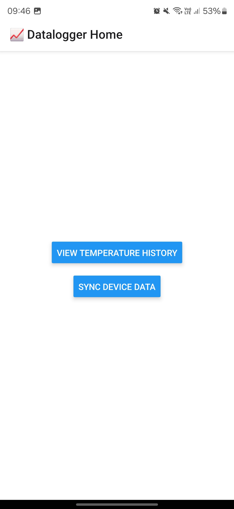
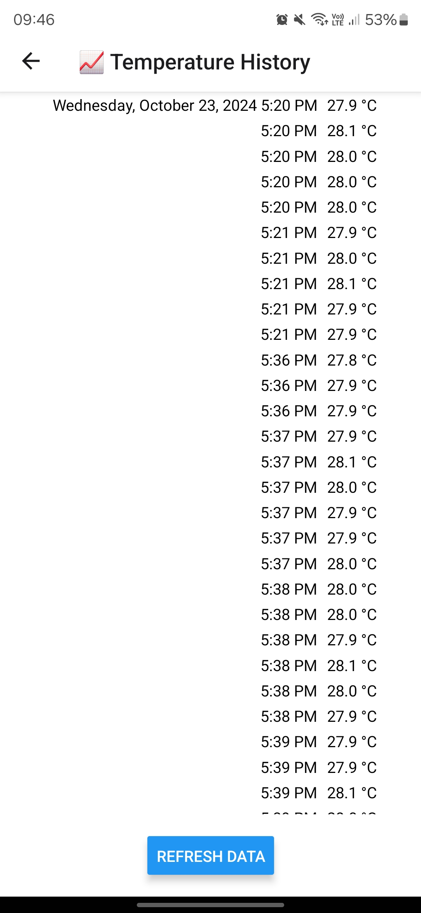
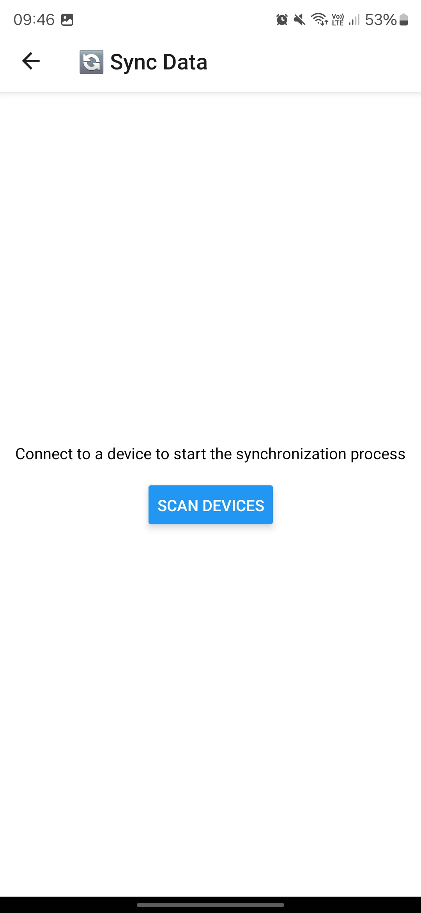

# Datalogger

This project is made of three parts:

* A Rails `back-end` with `GraphQL` (this repo) that stores temperature data
* A [ESP32 Logging](https://github.com/vghellere/datalogger-esp32) board with a temperature sensor that stores temperature data
* A ReactNative (Expo) [project](https://github.com/vghellere/datalog-reactnative) that reads the temperature data from the ESP32 via Bluetooth and sends it to the `back-end`

# Workflow

* the ESP32 reads the temperature data from the sensor and stores it in a memory buffer
* the ReactNative app connects to the ESP32 via Bluetooth and
  * syncs the ESP32 internal RTC (Real Time Clock)
  * gets the samples (timestamp/temperature) stored in the ESP32
  * sends the data to the `back-end` Rails app via `GraphQL`

Both the ReactNative and the Rails app have a Dashboard for viewing the Temperature Data

# Screenshots

# Todo / Points of improvement / Future work

* Rails:
  * GraphQL: add authentication and rate limiting
  * Add a chart to the Dashboard
  * Add `device` model and associate `user -> device -> temperatureSample` 
  * Make `temperatureSample` more generic to represent any kind of measurement, not only temperature
* ReactNative:
  * Add tests
  * Add authentication
  * Handle the case where we fetch the data from ESP32 but the RN app can't send the data to the back-end. Right now the data is lost
  * Improve error handling
* ESP32:
  * Implement a FIFO for the sample buffer (it's currently using a LIFO)
  * Make the ESP32 go into deep sleep in between readings and wake up periodically to sync the data
  * Use the [standardized](https://github.com/sputnikdev/bluetooth-gatt-parser/blob/master/src/main/resources/gatt/characteristic/org.bluetooth.characteristic.temperature_measurement.xml) `org.bluetooth.characteristic.temperature_measurement` BLE Type to communicate the `timestamp/temperature` data
  * Implement device ID and firmware version
